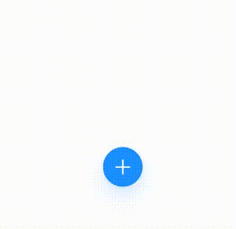

- An animated floating button that reveal and hide actions buttons on click.

- It comes with a built-in TypeScript typings and is compatible with all popular JavaScript frameworks. You can use it directly or leverage well-maintained wrapper packages that allow for a more native integration with your frameworks of choice.

# Example:



## How to use:

```
  <ActionsFloatingButton
      actionButtons={[
        {
          id: 0,
          icon: () => <MaterialIcons name="create" size={30} color="#FFFF" />,
        },
        {
          id: 1,
          icon: () => (
            <Ionicons name="create-outline" size={30} color="#FFFF" />
          ),
        },
      ]}

    />
```

#ActionButton Props -

| Name    | Type              | Default |
| ------- | ----------------- | ------- |
| id      | number            |
| icon    | () => JSX.Element |
| style   | ViewStyle         |
| onClick | () => void        |

#ActionsFloatingButton Props -
| Name | Type | Default |
| ----- | ----------------- | ------- |
| actionButtons?| ActionButton[]|
| mainButton|ActionButton|
| animateMainButton?| boolean|
| style?| ViewStyle|
